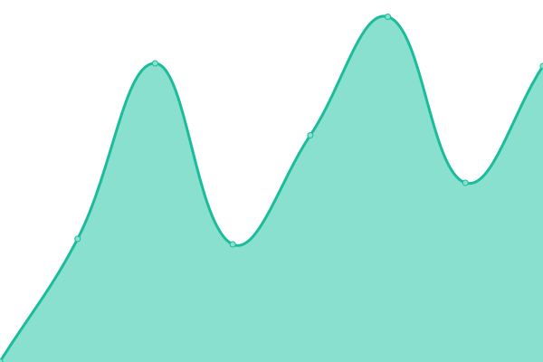

# [📈 Live Status](https://Tartan-Web-Design.github.io/monitoring): <!--live status--> **🟧 Partial outage**

This repository contains the open-source uptime monitor and status page for [Tartan Web Design](https://tartanwebdesign.net), powered by [Upptime](https://github.com/upptime/upptime).

With [Upptime](https://upptime.js.org), you can get your own unlimited and free uptime monitor and status page, powered entirely by a GitHub repository. We use [Issues](https://github.com/Tartan-Web-Design/monitoring/issues) as incident reports, [Actions](https://github.com/Tartan-Web-Design/monitoring/actions) as uptime monitors, and [Pages](https://Tartan-Web-Design.github.io/monitoring) for the status page.

<!--start: status pages-->
<!-- This summary is generated by Upptime (https://github.com/upptime/upptime) -->
<!-- Do not edit this manually, your changes will be overwritten -->
<!-- prettier-ignore -->
| URL | Status | History | Response Time | Uptime |
| --- | ------ | ------- | ------------- | ------ |
|  [Tartan Web Design](https://tartanwebdesign.net) | 🟩 Up | [tartan-web-design.yml](https://github.com/Tartan-Web-Design/monitoring/commits/HEAD/history/tartan-web-design.yml) | 

 742ms
     
 | 

<a href="https://Tartan-Web-Design.github.io/monitoring/history/tartan-web-design">100.00%</a>
    

|  [Edge Adventures](https://www.edgeadventures.uk) | 🟩 Up | [edge-adventures.yml](https://github.com/Tartan-Web-Design/monitoring/commits/HEAD/history/edge-adventures.yml) | 

 3242ms
     
 | 

<a href="https://Tartan-Web-Design.github.io/monitoring/history/edge-adventures">100.00%</a>
    

|  [Really Excellent](https://www.reallyexcellentinternships.com) | 🟩 Up | [really-excellent.yml](https://github.com/Tartan-Web-Design/monitoring/commits/HEAD/history/really-excellent.yml) | 

 1387ms
     
 | 

<a href="https://Tartan-Web-Design.github.io/monitoring/history/really-excellent">100.00%</a>
    

|  [RecycleSV](https://www.recyclesv.com) | 🟩 Up | [recycle-sv.yml](https://github.com/Tartan-Web-Design/monitoring/commits/HEAD/history/recycle-sv.yml) | 

 1893ms
     
 | 

<a href="https://Tartan-Web-Design.github.io/monitoring/history/recycle-sv">100.00%</a>
    

|  [Primal Bushcraft](https://www.primalbushcraftsurvival.com) | 🟥 Down | [primal-bushcraft.yml](https://github.com/Tartan-Web-Design/monitoring/commits/HEAD/history/primal-bushcraft.yml) | 

 0ms
     
 | 

<a href="https://Tartan-Web-Design.github.io/monitoring/history/primal-bushcraft">0.00%</a>
    

|  [Tutornet](https://www.tutornet.co.uk) | 🟩 Up | [tutornet.yml](https://github.com/Tartan-Web-Design/monitoring/commits/HEAD/history/tutornet.yml) | 

 1096ms
     
 | 

<a href="https://Tartan-Web-Design.github.io/monitoring/history/tutornet">100.00%</a>
    

<!--end: status pages-->

[**Visit our status website →**](https://Tartan-Web-Design.github.io/monitoring)

## 📄 License

- Powered by: [Upptime](https://github.com/upptime/upptime)
- Code: [MIT](./LICENSE) © [Tartan Web Design](https://tartanwebdesign.net)
- Data in the `./history` directory: [Open Database License](https://opendatacommons.org/licenses/odbl/1-0/)
